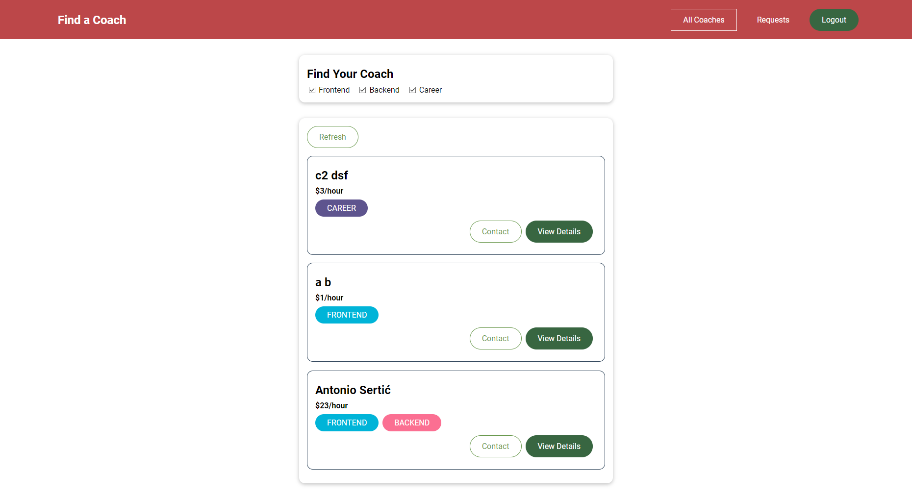

# Find a Coach - Udemy Vue Course

## Description

This repository contains the project "Find a Coach" developed as part of the [Vue - The Complete Guide (incl. Router & Composition API)](https://www.udemy.com/course/vuejs-2-the-complete-guide/) course on Udemy. Find a Coach is a web application that connects users with coaches or mentors for various skills and expertise.

## Features

- User Authentication: Users can create accounts and log in to access additional features.
- Coach Search: Users can search for coaches based on different categories and filters.
- Coach Profiles: Each coach has a detailed profile showcasing their skills, experience, and pricing.
- Coach Contact: Users can contact coaches directly through the app.
- Coach Registration: Experienced individuals can apply to become a coach through the registration form.

## Technologies Used

- HTML5 and CSS3 for the user interface.
- Vue.js for the application's logic and dynamic data binding.
- Vue Router is used for handling different views and navigation.
- The Composition API is utilized to manage component logic.
- Firebase is used for user authentication and real-time database storage.

## Installation and Running

1. Clone this repository to your computer using `git clone`.

2. Navigate to the project directory.

3. Install the necessary dependencies using `npm install`.

4. Start the development server using `npm run serve`.

## Project Structure

The project follows a structured organization:

- `app.vue`: The main Vue component containing the root of the application.
- `components`: A directory containing reusable Vue components used in the app.
- `pages`: A directory containing Vue components representing different pages of the app.
- `store`: A directory containing Vuex store modules for state management.
- `router`: A directory containing Vue Router configuration.

## Credits

Find a Coach was created as part of the [Vue - The Complete Guide (incl. Router & Composition API)](https://www.udemy.com/course/vuejs-2-the-complete-guide/) course on Udemy, instructed by [Maximilian Schwarzmüller](https://www.udemy.com/user/maximilian-schwarzmuller/). The design, code, and concepts are based on the course content.
